# claude-code-spec-driven-development

A spec-driven-development (SDD) toolkit for **Claude Code** — state a goal in plain language and let Claude drive the whole pipeline: clarify → specs → implement-until-it-matches → archive → record context. Built on top of [OpenSpec](https://github.com/Fission-AI/OpenSpec).

## The pipeline (two phases, human review in between)

```mermaid
flowchart LR
    subgraph P1["PHASE 1 · Plan &amp; Specify — /my-goal"]
        direction TB
        A1["0 · Resume-check"] --> A2["1 · Rate clarity 🟢 / 🟡 / 🔴"]
        A2 --> A3["2 · Clarify — grill-me / explore"]
        A3 --> A4["3 · /opsx:propose → specs + tasks"]
        A4 --> A5["4 · Write ADR(s)"]
        A5 --> A6["5 · Recommend experts"]
        A6 --> A7["6 · STOP — hand off for review"]
    end

    GATE{{"👁  human reviews &amp; approves specs + ADRs"}}

    subgraph P2["PHASE 2 · Build — /implement-specs"]
        direction TB
        B1["0 · Load change + ADRs + experts"] --> B2["1 · Confirm experts"]
        B2 --> B3["2 · spec-loop: implement → review → fix → repeat (cap 6)"]
        B3 --> B4["3 · Quality gate (lint / build / test)"]
        B4 --> B5["4 · /opsx:archive"]
        B5 --> B6["5 · Auto-record logic + why to memory"]
    end

    A7 --> GATE --> B1
```



**Why split?** `/my-goal` only plans — it never writes production code, so a human reviews the specs + ADRs before any implementation. `/implement-specs` is the build phase; invoking it *is* the approval. **Adaptive interrogation:** how hard `/my-goal` grills you depends on how clear the task is (🟢 light → 🔴 grill hard). Override anytime ("nhẹ thôi" / "grill kỹ").

## What's in this repo

| Path | What |
|------|------|
| `skills/my-goal/` | **Phase 1** — clarify → specs + ADRs → recommend experts → STOP for review (no code) |
| `skills/implement-specs/` | **Phase 2** — load approved specs/ADRs → spec-loop via experts → quality gate → archive → record context |
| `skills/spec-loop/` | Autonomous implement → **independent** fresh-subagent review vs FINAL specs → fix → repeat until matched (cap 6) |
| `skills/what-now/` | Read-only cheat-sheet — "you are here" on the pipeline + next command + skill inventory |
| `commands/*.md` | Thin slash-command wrappers (`/my-goal`, `/implement-specs`, `/spec-loop`, `/what-now`) |
| `docs/CLAUDE-snippet.md` | Paste-in block for a project's `CLAUDE.md` so Claude defaults to this flow |
| `install.sh` | Installs skills/commands into `~/.claude/` + all dependencies |

## Dependencies (auto-installed by `install.sh`)

`install.sh` installs all of these for you (and is idempotent — skips anything already present). They are **not** vendored into this repo, just installed from their own sources:

| Dependency | Source | Used by | Manual command |
|------------|--------|---------|----------------|
| **OpenSpec CLI** | npm `@fission-ai/openspec` | Steps 3/7 (propose/archive) | `npm install -g @fission-ai/openspec@latest` |
| **grill-me** skill | [@mattpocock](https://github.com/mattpocock/skills) (MIT) | Step 2 (clarify) | `npx skills add mattpocock/skills --skill=grill-me -y -g` |
| **dev-workflows** plugin | gh `shinpr/claude-code-workflows` | Step 4/6 (`task-analyzer`, `code-verifier`, `quality-fixer`) | `claude plugin marketplace add shinpr/claude-code-workflows && claude plugin install dev-workflows@claude-code-workflows` |
| **fullstack-dev-skills** plugin | gh `jeffallan/claude-skills` | Step 4 experts (`nestjs-expert`, `postgres-pro`, `react-expert`, `typescript-pro`, …) | `claude plugin marketplace add jeffallan/claude-skills && claude plugin install fullstack-dev-skills@fullstack-dev-skills` |

After install, run `openspec init --tools claude` in each project. `my-goal` only ever picks experts that are actually present in your environment, so the two plugin packs are recommended but not strictly required.

## Install

```bash
git clone git@github.com:nnguyenquangg/claude-code-spec-driven-development.git
cd claude-code-spec-driven-development
./install.sh          # symlinks into ~/.claude (default) — re-run after pulling updates
./install.sh --copy   # copy instead of symlink
```

Then install the dependencies above, and **restart Claude Code** so the new skills/commands appear.

## Per-project setup

1. `openspec init --tools claude` in the project root.
2. Paste `docs/CLAUDE-snippet.md` into the project's `CLAUDE.md` so Claude proactively drives the loop.

## Usage

```
/my-goal "add Excel export to the P&L report"   # Phase 1 — plan it: specs + ADRs, then stops for review
# … you review & approve the specs/ADRs …
/implement-specs                                 # Phase 2 — build it: spec-loop until the code matches
/what-now                                        # forgot where you are? this orients you
/spec-loop                                       # just the autonomous implement-until-match loop on the active change
```

## License

MIT (the three skills/commands in this repo). `grill-me` and OpenSpec are separate projects under their own licenses.
